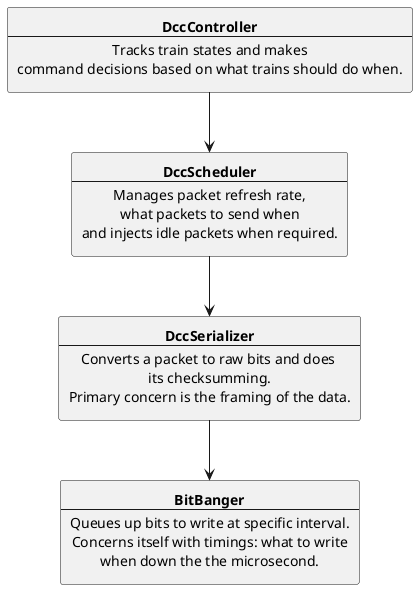

# DCC Commander
----

This is a simple framework to control model trains with the dcc protocol.
This implementation focusses on simplicity and flexibillity.

## Overview: Layers

```plantuml
@startuml
top to bottom direction
skinparam defaultTextAlignment center

rectangle DccController [
  **DccController**
  ----
  Tracks train states and makes
  command decisions based on what trains should do when.
]

rectangle DccScheduler [
  **DccScheduler**
  ----
  Manages packet refresh rate,
  what packets to send when
  and injects idle packets when required.
]

rectangle DccSerializer [
  **DccSerializer**
  ----
  Converts a packet to raw bits and does 
  its checksumming.
  Primary concern is the framing of the data.
]

rectangle BitBanger [
  **BitBanger**
  ----
  Queues up bits to write at specific interval.
  Concerns itself with timings: what to write
  when down the the microsecond.
]

DccController-->DccScheduler
DccScheduler-->DccSerializer
DccSerializer-->BitBanger
@enduml
```