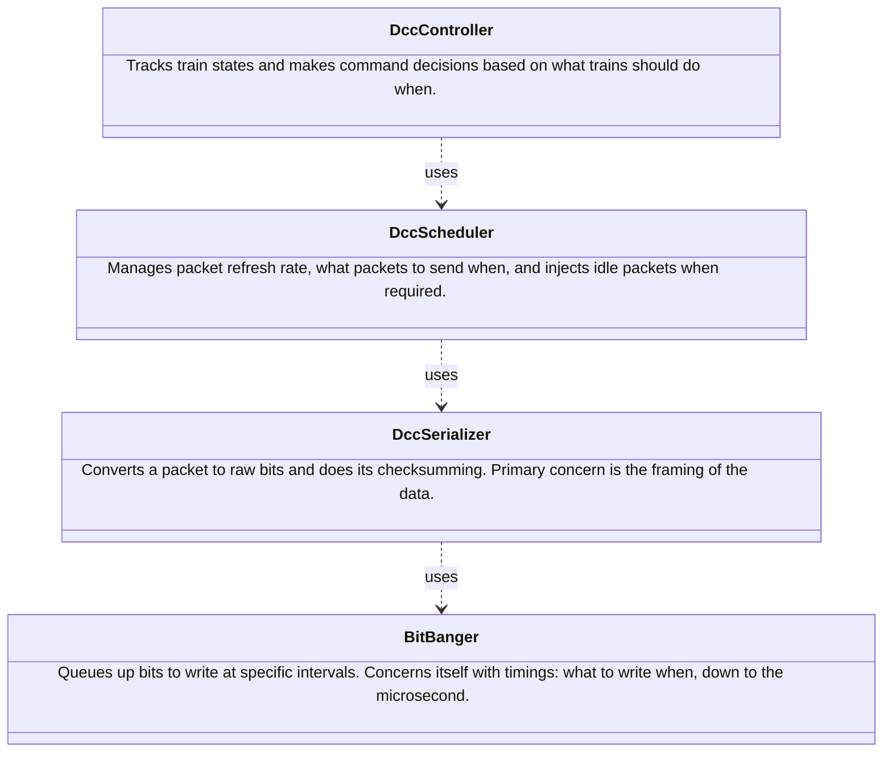

# DCC Commander
----

This is a framework to control model trains over the dcc protocol.
This implementation focusses on simplicity and flexibillity.

## Overview: Layers

```mermaid
classDiagram
    class DccController {
        Tracks train states and makes command decisions based on what trains should do when.
    }

    class DccScheduler {
        Manages packet refresh rate, what packets to send when, and injects idle packets when required.
    }

    class DccSerializer {
        Converts a packet to raw bits and does its checksumming. Primary concern is the framing of the data.
    }

    class BitBanger {
        Queues up bits to write at specific intervals. Concerns itself with timings: what to write when, down to the microsecond.
    }

    DccController ..> DccScheduler : uses
    DccScheduler ..> DccSerializer : uses
    DccSerializer ..> BitBanger : uses
```