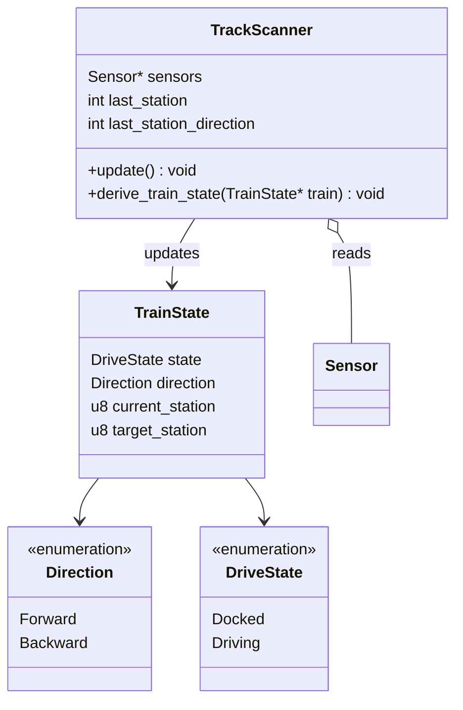

# Design

Small design document on certain aspects of the higher level train system

```mermaid
classDiagram
    direction TB

    class Direction {
        <<enumeration>>
        Forward
        Backward
    }

    class DriveState {
        <<enumeration>>
        Docked
        Driving
    }

    class TrainState {
        DriveState state
        Direction direction
        u8 current_station
        u8 target_station
    }

    class TrackScanner {
        Sensor* sensors
        int last_station
        int last_station_direction

        +update() void
        +derive_train_state(TrainState* train) void
    }

    TrackScanner --> TrainState : updates
    TrainState --> Direction
    TrainState --> DriveState
    TrackScanner o-- Sensor : reads
```